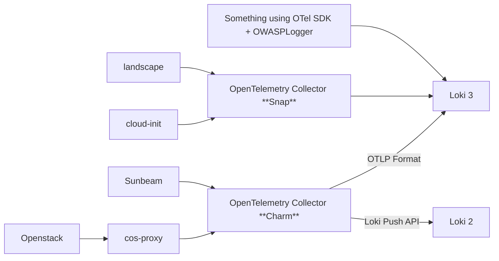

# OWASP Logger

**🚧 This readme is work in progress! 🚧**

## Installation

The package is not yet in PyPi, so you should install it from the git repo:

```bash
# Standalone logger (without OTel dependencies)
uv pip install "git+https://github.com/lucabello/owasp-logger"
# Additional OTel logger
uv pip install "git+https://github.com/lucabello/owasp-logger[otel]"
```

## Usage

Example usage:

```
# Create a virtual environment
uv venv  # or the classic 'python -m venv .venv'
source .venv/bin/activate

# Install the owasp-logger library
uv pip install "git+https://github.com/lucabello/owasp-logger"

# Try the logger from the Python shell
python
>>> from owasp_logger import OWASPLogger
>>> logger = OWASPLogger(appid="coconut.app")
>>> logger.authn_login_lock(user="banana-bob")
{"datetime": "2025-09-26T12:37:37.886421+02:00", "appid": "coconut.app", "event": "authn_login_lock:banana-bob,maxretries", "level": "WARNING", "description": "User banana-bob login locked because maxretries exceeded", "type": "security"}

# Try out the examples
python examples/nested_json.py

# If you want the OTel format, install the owasp-logger[otel] extension
uv pip install "git+https://github.com/lucabello/owasp-logger[otel]"
python examples/otel.py
```

## Getting OWASP logs in Loki

To get your logs into Loki, we recommend using an OpenTelemetry Collector (charm or snap, depending on your needs).



### Why you need an OpenTelemetry Collector

What should logs look like before reaching Loki?

In order to label logs consistently and make reliable dashboards, we need the OWASP information to be a nested **attribute**. Here's what a log line looks like in OTel format:

```json
{
    "body": "Administrator banana-bob has updated privileges of user coconut-charlie from user to admin",
    "severity_number": 13,
    "severity_text": "WARN",
    "attributes": {
        "owasp_event": {
            "datetime": "2025-09-19T14:31:58.140099+02:00",
            "type": "security",
            "appid": "example.appid",
            "event": "authz_admin:coconut-charlie,user_privilege_change",
            "level": "WARNING",
            "description": "Administrator banana-bob has updated privileges of user coconut-charlie from user to admin"
        },
        "code.file.path": "/home/aegis/Repositories/Canonical/owasp-logger/src/owasp_logger/logger.py",
        "code.function.name": "_log_event",
        "code.line.number": 26
    },
    "dropped_attributes": 0,
    "timestamp": "2025-09-19T12:31:58.140189Z",
    "observed_timestamp": "2025-09-19T12:31:58.140207Z",
    "trace_id": "0x00000000000000000000000000000000",
    "span_id": "0x0000000000000000",
    "trace_flags": 0,
    "resource": {
        "attributes": {
            "telemetry.sdk.language": "python",
            "telemetry.sdk.name": "opentelemetry",
            "telemetry.sdk.version": "1.33.1",
            "service.name": "example-service"
        },
        "schema_url": ""
    }
}
```

The `owasp#_event` attribute will be mapped as-is to **structured metadata** in Loki. The metadata existing with this format is foundational to any dashboard trying to visualize OWASP information.

Given that logs can have various formats depending on the application, the easiest way to get those attributes in place is to configure some *custom processors* in an OpenTelemetry Collector to parse the OWASP information from your log line. The following sections explain how to do so.

### How to configure an OpenTelemetry Collector

This README classifies logs according to the [OpenTelemetry documentation](https://opentelemetry.io/docs/concepts/signals/logs/).

#### Structured logs

A structured log is a log whose textual format follows a consistent, machine-readable format. For applications, one of the most common formats is JSON.

##### OpenTelemetry format

If the application is already using the OTel format for logs, `OWASPLogger` will make sure the OWASP information is in the correct place, so there are no additional steps.

##### Generic JSON

??? instructions for parsing arbitrary json logs ???

#### Semistructured Logs

A semistructured log is a log that does use some self-consistent patterns to distinguish data so that it’s machine-readable, but may not use the same formatting and delimiters between data across different systems. One example of this is `juju debug-log`.

You have to add some custom processors to the OpenTelemetry Collector configuration to parse the OWASP json blob from your logs.

> [!NOTE]
> **How do I configure custom processors?**  
> In the **charm**, use the `custom_processors` Juju config option.
> In the **snap**, add the processors config under the `processors:` top-level key, then add the processor name in the related logs pipeline.

##### juju debug-log

??? instruction for parsing juju debug-log ???

```yaml
transform/owasp-cleanup:
  log_statements:
    - context: log
      statements:
        # TODO: finish looking into this
        - merge_maps(attributes, ExtractPatterns(body, "^(?P<prefix>.*?)(?P<json>\\{.*\\}?$"), "upsert")
```

TODO: add how logs appear in Loki (structured metadata?) and how to make a dashboard from them


#### Unstructured logs

??? not recommended, write your own parsing logic ???
